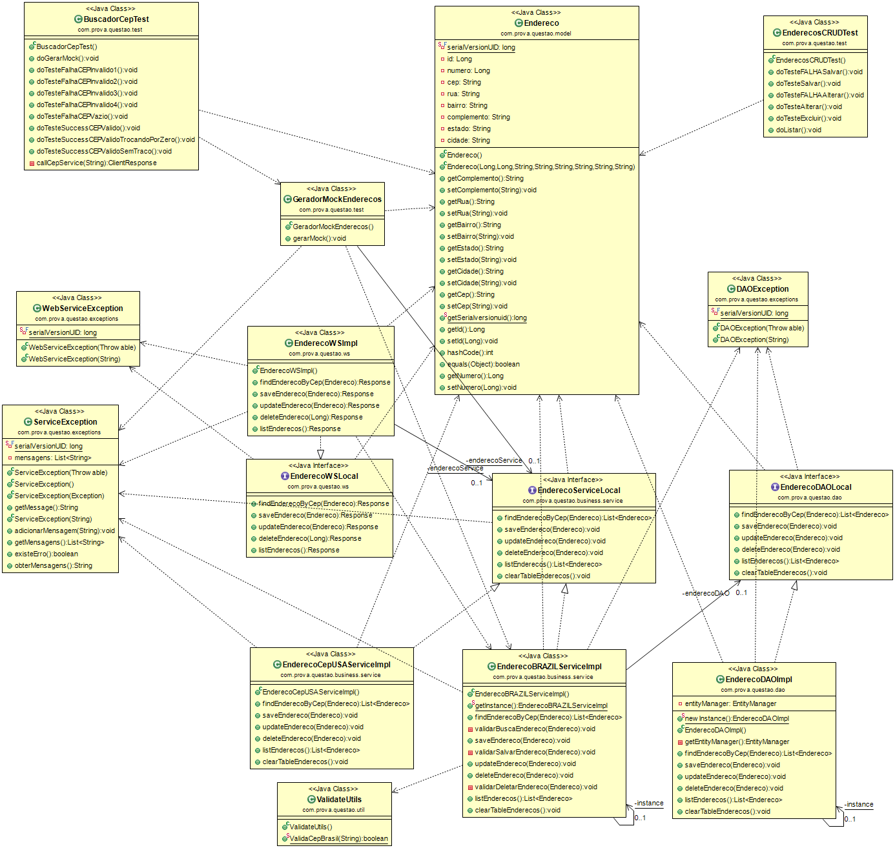

# Sistema de Estacionamento utilizando java EE

### REQUISITOS E INSTRUCOES PARA EXECUTAR O PROJETO

* Necessario ter o MYSQL SERVER instalado (https://dev.mysql.com/downloads/mysql/)  com a base bancoestacionamento criada (ou alterar as configuracoes no persistence.xml);

* Necessario um servidor de aplicacao ou um container web para rodar. O projeto esta em formato WAR e foi testado no SERVIDOR Tomcat 7 (https://tomcat.apache.org/download-70.cgi);

* Por padrao os testes foram executados na porta 8080 do servidor. se possivel configurar o servidor nesta porta, ou alterar a porta nas classes de teste;

* E necessário ter o JDK instalado(build path esta para o java 7);

### PARA TESTAR

* Para executar os teste AUTOMATIZADOS, iniciar o servidor e executar o projeto com o j-unit. simplesmente roda-lo com j-unit;

* Para testes MANUAIS foi criado uma interface WEB. Ir para o Endereço http://localhost:8080/estacionamento/ e executar os testes manuais;

### DOCUMENTACOES

#### Class Diagram

 
#### Javadoc

[Acesse clicando aqui](docs/javadoc/index.html)

### ARQUITETURA UTILIZADA NO DESENVOLVIMENTO 

* Foi feito um projeto web utilizando camada de camada web (web service restful) , servico(negocio) e camada DAO(mysql com jpa + hibernate);

* Web service foi feito com jersey,jackson(para interpretar json) e jax-ws;

* Servico foi feito com validations e metodos de validacao de regras de negocio;

* DAO - foi feito com JPA2.0 com Hibernate 4.0 com persistence Manager e controle de transa?oes;

* Banco de dados MySql;

### Libs Utilizadas
	antlr-2.7.7.jar
	commons-collections-3.2.1.jar
	dom4j-1.6.1.jar
	geronimo-jta_1.1_spec-1.1.1.jar
	hibernate-commons-annotations-4.0.1.Final.jar
	hibernate-core-4.0.1.Final.jar
	hibernate-entitymanager-4.0.1.Final.jar
	hibernate-infinispan-4.0.1.Final.jar
	hibernate-jpa-2.0-api-1.0.1.Final.jar
	hibernate-validator-4.2.0.Final.jar
	jackson-all-1.9.5.jar
	javassist-3.18.1-GA.jar
	jboss-logging-3.3.0.Final.jar
	jersey-bundle-1.19.jar
	junit-4.10.jar
	mysql-connector-java-5.1.21-bin.jar
	org.json-20120521.jar

### PARTTERNS UTILIZADOS 

* Strategy
* Factory
* SingleTon
* Model view controller(MVC)
* Service-to-work(Business Delegate)
* DAO
* Data Transfer Objects (DTO)
* Session Facade
